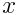
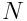
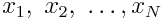
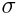
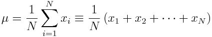
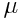

# Python Exercise 1:  Working with large datafiles

Cameron F. Abrams, `cfa22@drexel.edu`

2018

## Introduction

Let  be a random variable.  For any sequence
of  values of , 
we define the mean  and the standard deviation 
 as follows:


 


In this assignment, you will develop a program that can compute 
 and 
for a long sequence of numbers.  Before turning to the assignment,
it is worth thinking about how you might go about computing an average
of a sequence of, say, 1,048,577 random numbers stored in plain text file.
(Note that if these numbers are decimals to 8 significant digits, this file
would be about 12 megabytes in size.)  Some ideas:

1. _By hand_.  You could print out the file (if they are arranged one per line, then this would be about 21,000 pages, or 42 reams), and
then you could sum them up using a calculator, and divide the sum by 1,048,577.  If 
you can enter an 8-digit number in about 5 s, then this would take about 61 days
of solid effort, assuming you made no mistakes and did not have to sleep, eat, or take breaks of any kind.

2. _Using Excel_.  You could try import the text file into Excel.  Before you do this, you might envision
that you will import the data into column `A` and that it will occupy cells 
`A1` to `A1048577`, then you would just click on an empty cell, and type
`=average($A$1:$A$1048577)` and hit return.  However, if you try to do this, you will crash Excel, since
it cannot handle more than 1,048,576 rows!  But you really like Excel, so you could import half
the data into colum A and the other half into column B, and then compute the sum of A and the sum of B
separately, add them together to get the total sum, and divide _that_ by 1,048,577 to get the mean.

3. _Using a computer program_.  Of course, neither of those ways is really what you should do. The first is
not feasible, and the second is tedious and inelegant.  But a computer program can be developed that easily 
handles this task.  How might such a program work?  A lot like the _algorithm_ from number 1 above:

   1.  Open the file (electronically) named by the user.
   2.  Initialize a tally to zero and a counter to zero.
   3.  Read the next line in the file; interpret what you see as a number.
   4.  Add that number to a running tally, and add 1 to a counter to keep track of how many numbers you've read.
   5.  Ask if you are at the end of the file.  If no, go to 2.  If yes, then divide the tally by the counter, and that's the mean.
   6.  Print out the value of the mean for the user to see.
   7.  Exit.

This assignment _begins_ with both a datafile `data1` and a python program `seed.py` that does just this.  In this assignment
you will modify `seed.py` so that it additionally computes the standard deviation of the data.

## Programming Concepts

The main concept this assignment demonstrates is file input.  With reference to `seed.py`, we first import the `fileinput` module:
```
import fileinput
```

Then, we make use of the `input()` function.  This function returns the entire content of the file as an array of character strings, with each
array element corresponding to one line.  The lack of an argument to `input()`
results in reading the input file named in the first command-line argument switch.  We then use the iterator `line` to iterate over this array
to process each line one at a time:
```
for line in fileinput.input():
  tally += float(line)
```

Here, the "stuff" we do refers to tallying and counting the data.  In order to do this, we need to type-convert the input line, since python
reads the ASCII text as a character string.  This conversion is done with the `float()` function. 

## The Assignment

1. Have look at `data1`:
```
$ head data1
1.99488326
1.82089182
3.20215874
3.15060866
2.59427922
3.90913010
1.84078836
1.67044199
2.82520238
1.87266323
```
This is an ASCII text file with 1,048,577 lines.
Each line has one number on it.

2. Run the python program `seed.py` to report the average of the numbers in `data1`:
```
$ python seed.py data1
Average: 2.29994
Program ends.
```

3. Copy seed.py to my_pgm.py, and edit my_pgm.py 
so that it additionally reports the standard deviation 
of the data.

