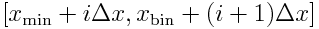

# Python Exercise 3:  Working with large datafiles (part 3)

Cameron F. Abrams, `cfa22@drexel.edu`

2018

## Introduction

In this exercise, you will learn how to generate a histogram from random data, and to plot the histogram.   
A histogram is a type of integer-array in which each element is a count of how many times a value is observed (when scanning a sequence of values) to lie in a particular "bin".  
If, as is the case here, the values are floating point, we usually choose to work with bins that correspond to subdomains of some uniform finite width  that cover the entire domain over which values are observed.  
For this reason, when histogramming data, it is a good idea to know ahead of time what the minimum and maximum values of the data are; call these  and .  This way, the array index `i`, which is an integer, can be used to tell us the values that enclose the `i`th bin: .  To generate a histogram from a sequence of values, one performs an operation on each value to decide which bin to increment (i.e., add one to). 

## Programming Concepts

This will build on the file-input skills of Exercise 01 and the array-manipulation skills of Exercise 02.  Here, we will first implement histogram generation manually using arrays.  Then, in a second version, we will use NumPy and MatPlotLib to simultaneously histogram the data and plot it.

## The Assignment

1. Use the solution to Exercise 01 as a seed for this exercise.  Generate and plot a histogram that spans the domain [-10:10] with bins of size  = 0.1.

2. Modify this code to use the `matplotlib.pyplot.hist()` function.

## Solutions

