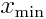

# Python Exercise 3:  Working with large datafiles (part 3)

Cameron F. Abrams, `cfa22@drexel.edu`

2018

## Introduction

In this exercise, you will learn how to generate a histogram from random data, and to plot the histogram.   A histogram is a type of integer-array in which each element is a count of how many times a value is observed (when scanning a sequence of values) to lie in a particular "bin".  If, as is the case here, the values are floating point, the bins correspond to subdomains of finite width that cover the entire domain over which values are observed.  For this reason, when histogramming data, it is a good idea to know ahead of time what the minimum and maximum values of the data are; call these  and , respectively.  So the histogram element at position `i` should contain the count of values observed to lie in the subdomain , where  is the constant bin width. 


This is a test: 

## Programming Concepts

This will build on the file-input skills of Exercise 01 and the array-manipulation skills of Exercise 02.  Here, we will use NumPy's `histogram` function to In addition to fileinput, this exercise also illustrates the use of _arrays_.  The NumPy library provides (among a _lot_ of other things) a lot of functions for manipulating arrays.  To access them, a convenient way is to `import` it:
```
import numpy as np
```

You will read each line of the file, recognize the individual elements on each line, and then interpret each as a number and increment the appropriate tallies.
A code fragment that may help you understand how to do this might look like this:

```
ncol = 3
tally = np.zeros(ncol)
for line in fileinput.input():
   xc = line.split(" ")
   for i in range(ncol):
     x = float(xc[i])
     # do stuff with x
```
Here, `ncol` represents the predetermined number of columns in the datafile.  (A more sophisticated program would detect this number by inspecting the file, but we are going to keep things a bit simpler here.)  The `tally` is a 3-element array that the NumPy `zeros` function creates and initializes with zeros.  The `line.split(" ")` call returns an array of character strings obtained by assuming that a space (" ") separates elements on a line; we call this array `xc`.  We use the `for` loop to visit each element of `xc`, and inside that loop we first convert the current element `xc[i]` to a floating point, `x`.  Then, we do whatever numerical stuff we want with `x`, like tallying it and its square.

For example, inside that `for` loop, you might see
```
     tally[i] = tally[i] + x
```

We also want to tally the squares, so we will need to create a new tally array for that.  We'll also need arrays for the minimum and maximum values.  Let's call them `xmin` and `xmax`.  Then, outside the main read-loop, you'll add lines like
```
xmin = np.full(ncol,1.e99)
xmax = np.full(ncol,-1.e99)
```
The NumPy `full` function returns an array of a given number of elements (the first argument), with each element initialized to a value (second argument).  Note that we are initializing the minimum to something very large and the maximum to something very small, so that the comparisons we make inside the loop will immediately start storing data from the file.

To find out whether or not the current element `i` in the current line `line` is the minimum (so far), you might use code like this:
```
     if x < xmin[i]:
	xmin[i] = x
```
From this, you should be able to figure out how to additionally test whether or not `x` is the maximum (so far).

## The Assignment

1. Write a python program incorporating the seed code above to process the file `data3` to compute the average, standard deviation, minimum value, and maximum value in each column of that file. (Note to instructors: the code `mkinputs.py` was used to generate `data3`.)

