# Python Exercise 4:  Image creation and complex numbers via the Mandelbrot set

Cameron F. Abrams, `cfa22@drexel.edu`

2018

## Introduction

Complex numbers play important roles in  many branches of physics and engineering analysis.  Briefly, a complex number 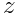 has two components, a "real" component 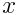, and an "imaginary" component 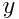, and is expressed as

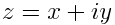

where the symbol 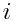 stands for 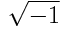.  
The "complex plane" is a 2-D coordinate system 
oriented with the real axis R horizontal and the imaginary axis I vertical;
in this plane, any complex number  can be 
thought of as a vector from the origin to the point 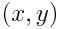:

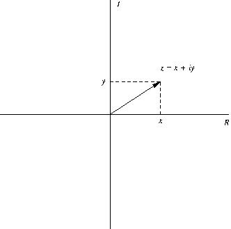

Also shown in this figure is the concept of the "complex conjugate" 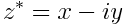.  One of the rules about arithmetic operations on complex numbers is that _squaring_ a complex number means multiplying it by its own complex conjugate:

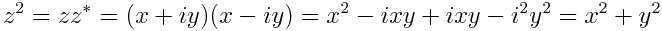

Note that this quantity has no imaginary component, and its square root (by Pythagoras) is just the length of the vector .

Our goal in this assignment is not to become experts in complex variables, but instead to explore one of their more famous representations and learn a little more Python programming.   

The thing we will examine here is a particular curve that lives in the complex plane.  This curve is special because it marks the boundary enclosing a special set of complex numbers called the Mandelbrot set, after the mathematician Benoit Mandelbrot.  A complex number 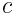, is in the Mandelbrot set if the sequence 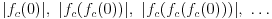 does not "blow up" (i.e., approach infinity), where

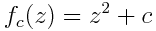.

In this exercise, we will write a two versions of a program that will generate a PNG image showing the Mandelbrot set.  As we will see, this curve that separates numbers in the set from those not in the set is _extremely_ complicated. In one version, we will color points in the set black and points not in the set white.  In the second version, we will use a more complicated scheme to choose what color to set points that are outside the set, based on how many iterations of the the function above are required to "know" the point is not in the set.

## Programming Concepts

This exercise demonstrates several concepts:
1.  Image creation and pixel-by-pixel manipulation;
2.  Nested looping;
3.  Complex numbers in NumPy; and
4.  Functions.

