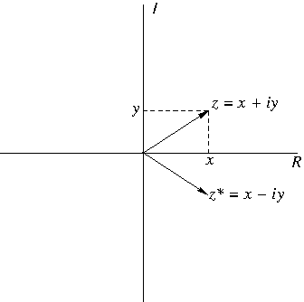
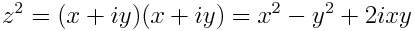

# Python Exercise 4:  Image creation and complex numbers via the Mandelbrot set

Cameron F. Abrams, `cfa22@drexel.edu`

2018

## Introduction

Complex numbers play important roles in  many branches of physics and engineering analysis.  Briefly, a complex number  has two components, a "real" component , and an "imaginary" component , and is expressed as


where the symbol  stands for .  
The "complex plane" is a 2-D coordinate system 
oriented with the real axis R horizontal and the imaginary axis I vertical;
in this plane, any complex number  can be 
thought of as a vector from the origin to the point :



_Squaring_ a complex number means multiplying it by itself:



Our goal in this assignment is not to become experts in complex variables, but instead to explore one of their more famous representations and learn a little more Python programming.   

The thing we will examine here is a particular curve that lives in the complex plane.  This curve is special because it marks the boundary enclosing a special set of complex numbers called the Mandelbrot set, after the mathematician Benoit Mandelbrot.  A complex number , is in the Mandelbrot set if the sequence  does not "blow up" (i.e., approach infinity), where

.

In this exercise, we will write a two versions of a program that will generate a PNG image showing the Mandelbrot set.  As we will see, this curve that separates numbers in the set from those not in the set is _extremely_ complicated. In one version, we will color points in the set black and points not in the set white.  In the second version, we will use a more complicated scheme to choose what color to set points that are outside the set, based on how many iterations of the the function above are required to "know" the point is not in the set.

## Programming Concepts

This exercise demonstrates several concepts:
1.  Nested looping;
2.  Functions;
3.  Complex number data types; and 
4.  Image creation and pixel-by-pixel manipulation.

## The Assignment

1.  Write a python program that loops over a field of pixels of with W and height H that corresponds to a region in the complex plane with the point (-2,-1) at the lower-left and the point (1,1) at the upper right.  That is, the width of the region is 3 units in W pixels, and the height is 2 units in H pixels; in order to keep the two axes at the same scale, let W = (3/2)H.  At each point, construct a complex number and print out its square.
(Note that python uses `j` to refer to .)  Use the program `seed.py` provided here, which implements a loop over all WxH pixels.

2. Write a function that accepts a single complex number and returns the number of iterations of the function above before the magnitude of the results exceeds 2.  Call this function for each point you visit in Part 1.

3. Import the `Image` module from the `PIL` (python image library), and create an 'RGB'-mode image of WxH pixels.  At each pixel in the loop, use the `putpixel` function to color the pixel black if the point is in the set and white otherwise.  After the loop, save the image in 'my_bw.png'.

The image below was created with H = 600.


4. Write a function that accepts a single floating point value, the values of its minimum and maximum range, and a list of triples, each of which is a color of your choosing in RGB format. The colors are assumed to correspond to equally spaced positions in this range, and the range is cyclic.  The function should use the value to determine an interpolated RGB triple between the two nearest input RGB triples.  This is a "palette".  Now, use this function to choose the color for each pixel, and make a new image 'my_color.png'

The image below was created using the followed ordered color palette:
```
# white in RGB
w=(255,255,255)
# a nice palette from iwanthue.com
c1=(197,124,60)
c2=(171,98,192)
c3=(114,165,85)
c4=(202,86,112)
c5=(99,140,204)
colors = [c1,c2,c3,c4,c5,w]
```
and using 0 for the minimum number of iterations and 50 for the maximum in the cyclic domain; the value used to select the palette color is the number of iterations modulo 50.


